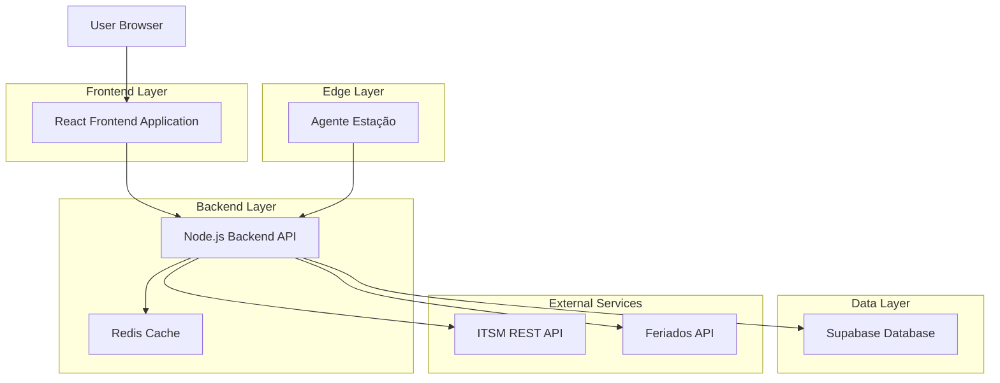
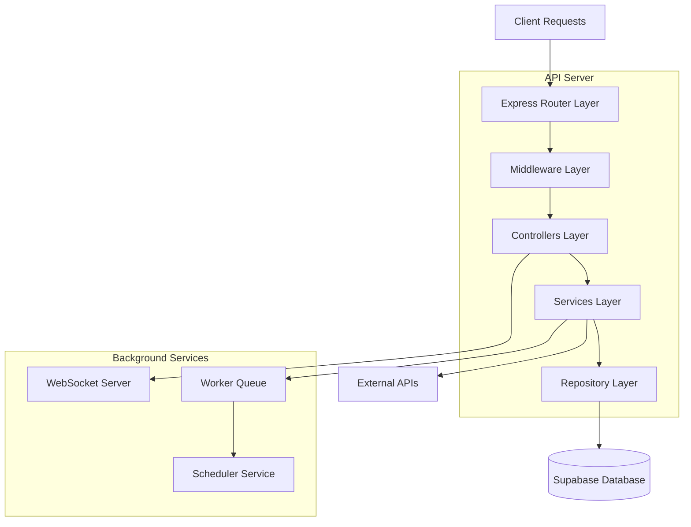
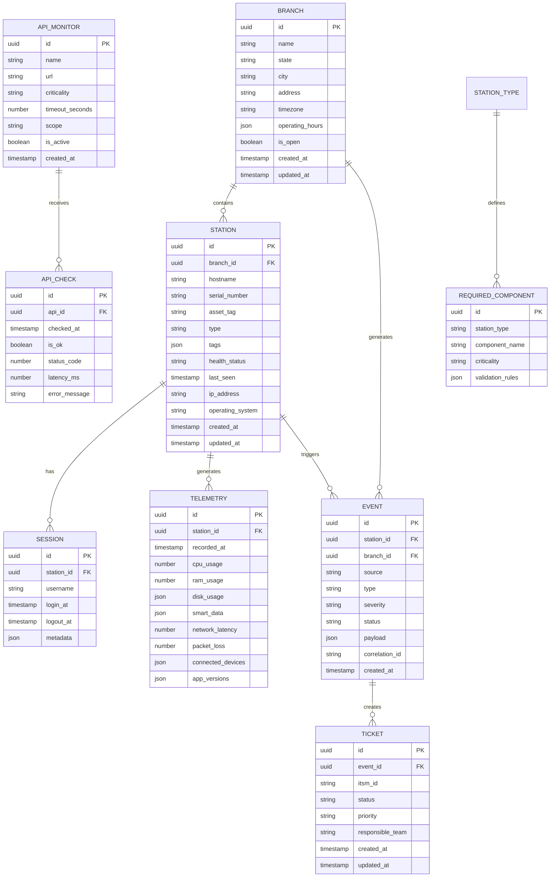

## 1. Architecture design



## 2. Technology Description

- Frontend: React@18 + TypeScript + TailwindCSS@3 + Vite
- Backend: Node.js@20 + Express@4 + TypeScript + WebSocket
- Database: Supabase (PostgreSQL@15)
- Cache: Redis@7
- Queue: Bull@4 (Redis-based)
- Initialization Tool: vite-init
- Testing: Jest + React Testing Library + Supertest

## 3. Route definitions

| Route | Purpose |
|-------|---------|
| / | Dashboard Principal com visão geral de todas as filiais |
| /filial/:id | Dashboard específico da filial com suas estações |
| /estacao/:id | Detalhes completos da estação com telemetria em tempo real |
| /apis | Monitoramento de APIs com status e latência |
| /eventos | Histórico de eventos e chamados do ITSM |
| /configuracoes | Gerenciamento de regras, thresholds e integrações |
| /login | Autenticação de usuários do sistema |

## 4. API definitions

### 4.1 Authentication

```
POST /api/auth/login
```

Request:
| Param Name | Param Type | isRequired | Description |
|------------|------------|------------|-------------|
| email | string | true | User email address |
| password | string | true | User password |

Response:
| Param Name | Param Type | Description |
|------------|------------|-------------|
| token | string | JWT authentication token |
| user | object | User profile data |

Example:
```json
{
  "email": "admin@company.com",
  "password": "securepassword123"
}
```

### 4.2 Stations

```
GET /api/stations
```

Query Parameters:
| Param Name | Param Type | isRequired | Description |
|------------|------------|------------|-------------|
| branch_id | string | false | Filter by branch ID |
| status | string | false | Filter by health status |
| page | number | false | Pagination page |
| limit | number | false | Items per page |

Response:
| Param Name | Param Type | Description |
|------------|------------|-------------|
| stations | array[] | List of stations with current health data |
| total | number | Total count for pagination |
| page | number | Current page number |

### 4.3 Telemetry

```
POST /api/telemetry/:station_id
```

Request Body:
| Param Name | Param Type | isRequired | Description |
|------------|------------|------------|-------------|
| cpu | number | true | CPU usage percentage |
| ram | number | true | RAM usage percentage |
| disk | object | true | Disk usage details |
| smart | object | true | SMART disk health data |
| network_latency | number | true | Network latency in ms |
| packet_loss | number | true | Packet loss percentage |
| devices | array[] | true | Connected devices list |
| app_versions | object | true | Installed applications versions |

### 4.4 API Monitoring

```
GET /api/api-monitors
```

Response:
| Param Name | Param Type | Description |
|------------|------------|-------------|
| monitors | array[] | List of API monitors with current status |
| summary | object | Availability summary statistics |

### 4.5 Events

```
GET /api/events
```

Query Parameters:
| Param Name | Param Type | isRequired | Description |
|------------|------------|------------|-------------|
| start_date | string | false | Filter events from date |
| end_date | string | false | Filter events until date |
| severity | string | false | Filter by severity level |
| station_id | string | false | Filter by station ID |
| page | number | false | Pagination page |

## 5. Server architecture diagram



## 6. Data model

### 6.1 Data model definition



### 6.2 Data Definition Language

**Branches Table (branches)**
```sql
-- create table
CREATE TABLE branches (
    id UUID PRIMARY KEY DEFAULT gen_random_uuid(),
    name VARCHAR(255) NOT NULL,
    state VARCHAR(2) NOT NULL,
    city VARCHAR(255) NOT NULL,
    address TEXT,
    timezone VARCHAR(50) DEFAULT 'America/Sao_Paulo',
    operating_hours JSONB DEFAULT '{"monday":"08:00-18:00","tuesday":"08:00-18:00","wednesday":"08:00-18:00","thursday":"08:00-18:00","friday":"08:00-18:00","saturday":"08:00-14:00","sunday":"closed"}',
    is_open BOOLEAN DEFAULT true,
    created_at TIMESTAMP WITH TIME ZONE DEFAULT NOW(),
    updated_at TIMESTAMP WITH TIME ZONE DEFAULT NOW()
);

-- create indexes
CREATE INDEX idx_branches_state ON branches(state);
CREATE INDEX idx_branches_city ON branches(city);
CREATE INDEX idx_branches_is_open ON branches(is_open);

-- grant permissions
GRANT SELECT ON branches TO anon;
GRANT ALL PRIVILEGES ON branches TO authenticated;
```

**Stations Table (stations)**
```sql
-- create table
CREATE TABLE stations (
    id UUID PRIMARY KEY DEFAULT gen_random_uuid(),
    branch_id UUID NOT NULL REFERENCES branches(id),
    hostname VARCHAR(255) UNIQUE NOT NULL,
    serial_number VARCHAR(255),
    asset_tag VARCHAR(255),
    type VARCHAR(50) NOT NULL,
    tags JSONB DEFAULT '[]',
    health_status VARCHAR(20) DEFAULT 'healthy' CHECK (health_status IN ('healthy', 'warning', 'critical', 'offline')),
    last_seen TIMESTAMP WITH TIME ZONE,
    ip_address INET,
    operating_system VARCHAR(255),
    created_at TIMESTAMP WITH TIME ZONE DEFAULT NOW(),
    updated_at TIMESTAMP WITH TIME ZONE DEFAULT NOW()
);

-- create indexes
CREATE INDEX idx_stations_branch_id ON stations(branch_id);
CREATE INDEX idx_stations_health_status ON stations(health_status);
CREATE INDEX idx_stations_last_seen ON stations(last_seen);
CREATE INDEX idx_stations_type ON stations(type);

-- grant permissions
GRANT SELECT ON stations TO anon;
GRANT ALL PRIVILEGES ON stations TO authenticated;
```

**Telemetry Table (telemetry)**
```sql
-- create table
CREATE TABLE telemetry (
    id UUID PRIMARY KEY DEFAULT gen_random_uuid(),
    station_id UUID NOT NULL REFERENCES stations(id),
    recorded_at TIMESTAMP WITH TIME ZONE DEFAULT NOW(),
    cpu_usage DECIMAL(5,2) CHECK (cpu_usage >= 0 AND cpu_usage <= 100),
    ram_usage DECIMAL(5,2) CHECK (ram_usage >= 0 AND ram_usage <= 100),
    disk_usage JSONB DEFAULT '{}',
    smart_data JSONB DEFAULT '{}',
    network_latency INTEGER,
    packet_loss DECIMAL(5,2) CHECK (packet_loss >= 0 AND packet_loss <= 100),
    connected_devices JSONB DEFAULT '[]',
    app_versions JSONB DEFAULT '{}'
);

-- create indexes
CREATE INDEX idx_telemetry_station_id ON telemetry(station_id);
CREATE INDEX idx_telemetry_recorded_at ON telemetry(recorded_at DESC);
CREATE INDEX idx_telemetry_station_recorded ON telemetry(station_id, recorded_at DESC);

-- grant permissions
GRANT SELECT ON telemetry TO anon;
GRANT ALL PRIVILEGES ON telemetry TO authenticated;
```

**API Monitors Table (api_monitors)**
```sql
-- create table
CREATE TABLE api_monitors (
    id UUID PRIMARY KEY DEFAULT gen_random_uuid(),
    name VARCHAR(255) NOT NULL,
    url TEXT NOT NULL,
    criticality VARCHAR(20) DEFAULT 'medium' CHECK (criticality IN ('low', 'medium', 'high', 'critical')),
    timeout_seconds INTEGER DEFAULT 30,
    scope VARCHAR(50) DEFAULT 'internal',
    is_active BOOLEAN DEFAULT true,
    created_at TIMESTAMP WITH TIME ZONE DEFAULT NOW()
);

-- create indexes
CREATE INDEX idx_api_monitors_criticality ON api_monitors(criticality);
CREATE INDEX idx_api_monitors_is_active ON api_monitors(is_active);

-- grant permissions
GRANT SELECT ON api_monitors TO anon;
GRANT ALL PRIVILEGES ON api_monitors TO authenticated;
```

**Events Table (events)**
```sql
-- create table
CREATE TABLE events (
    id UUID PRIMARY KEY DEFAULT gen_random_uuid(),
    station_id UUID REFERENCES stations(id),
    branch_id UUID REFERENCES branches(id),
    source VARCHAR(50) NOT NULL,
    type VARCHAR(100) NOT NULL,
    severity VARCHAR(20) DEFAULT 'info' CHECK (severity IN ('info', 'warning', 'critical')),
    status VARCHAR(20) DEFAULT 'open' CHECK (status IN ('open', 'acknowledged', 'resolved')),
    payload JSONB DEFAULT '{}',
    correlation_id VARCHAR(255),
    created_at TIMESTAMP WITH TIME ZONE DEFAULT NOW()
);

-- create indexes
CREATE INDEX idx_events_station_id ON events(station_id);
CREATE INDEX idx_events_branch_id ON events(branch_id);
CREATE INDEX idx_events_severity ON events(severity);
CREATE INDEX idx_events_status ON events(status);
CREATE INDEX idx_events_created_at ON events(created_at DESC);
CREATE INDEX idx_events_correlation ON events(correlation_id);

-- grant permissions
GRANT SELECT ON events TO anon;
GRANT ALL PRIVILEGES ON events TO authenticated;
```