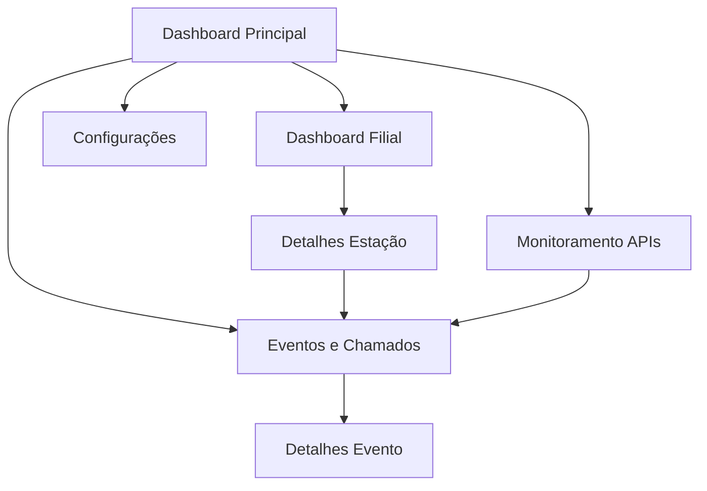

## 1. Product Overview

Sistema web multi-filial para monitoramento em tempo real da saúde operacional de estações de trabalho, garantindo que máquinas estejam aptas para atendimento ao cliente. O produto automatiza detecção de falhas, abertura de chamados no ITSM e monitora APIs críticas, silenciando incidentes quando lojas estão fechadas.

**Target:** Empresas com múltiplas filiais que necessitam garantir disponibilidade de estações de trabalho para atendimento ao cliente.

## 2. Core Features

### 2.1 User Roles

| Role | Registration Method | Core Permissions |
|------|---------------------|------------------|
| Admin Sistema | Manual registration | Full system access, configure rules, manage APIs, view all branches |
| Gerente Filial | Admin invitation | View and manage own branch stations, configure branch hours |
| Analista Suporte | Admin registration | View all stations, manage incidents, update ITSM tickets |
| Usuário Visualização | Admin registration | Read-only access to dashboards and reports |

### 2.2 Feature Module

O sistema de monitoramento consiste nas seguintes páginas principais:

1. **Dashboard Principal**: Visão geral de todas as filiais, mapa de saúde das estações, alertas críticos em tempo real
2. **Dashboard Filial**: Detalhes de uma filial específica, lista de estações, status operacional, horários de funcionamento
3. **Detalhes Estação**: Informações completas da estação, telemetria em tempo real, histórico de sessões, componentes obrigatórios
4. **Monitoramento APIs**: Lista de APIs monitoradas, status de disponibilidade, latência histórica, configuração de timeouts
5. **Eventos e Chamados**: Histórico de eventos gerados, chamados no ITSM, filtro por severidade e período
6. **Configurações**: Regras de saúde, thresholds, janelas de monitoramento, integração ITSM, feriados

### 2.3 Page Details

| Page Name | Module Name | Feature description |
|-----------|-------------|---------------------|
| Dashboard Principal | Mapa de Filiais | Visualizar status de todas as filiais em mapa interativo com cores indicando saúde geral |
| Dashboard Principal | Alertas Críticos | Exibir alertas de estações offline, APIs críticas indisponíveis, atividades indevidas |
| Dashboard Principal | Resumo Operacional | Mostrar total de estações online/offline, chamados abertos, incidentes do dia |
| Dashboard Filial | Lista de Estações | Exibir todas as estações da filial com status de saúde, usuário logado, último heartbeat |
| Dashboard Filial | Horário Funcionamento | Mostrar horário atual da filial, indicar se está aberta/fechada, próximos feriados |
| Dashboard Filial | Métricas da Filial | Apresentar taxa de disponibilidade, incidentes do mês, estações por tipo |
| Detalhes Estação | Informações Básicas | Exibir hostname, serial, patrimônio, IP, sistema operacional, tags, localização |
| Detalhes Estação | Telemetria Tempo Real | Mostrar CPU, RAM, disco, latência de rede, perda de pacotes, SMART em tempo real |
| Detalhes Estação | Sessões Ativas | Listar usuários logados, tempo de login, histórico de sessões do dia |
| Detalhes Estação | Componentes Obrigatórios | Verificar e listar componentes obrigatórios por tipo de estação, indicar ausências |
| Monitoramento APIs | Lista de APIs | Exibir todas as APIs monitoradas com status atual, latência média, taxa de erro |
| Monitoramento APIs | Histórico de Checks | Mostrar gráfico de disponibilidade e latência nos últimos 7 dias |
| Monitoramento APIs | Configuração de API | Permitir adicionar/editar URL, timeout, criticidade, escopo de monitoramento |
| Eventos e Chamados | Lista de Eventos | Filtrar eventos por data, severidade, tipo, estação, mostrar correlacionamento |
| Eventos e Chamados | Chamados ITSM | Exibir chamados abertos no ITSM, status, prioridade, time responsável |
| Eventos e Chamados | Detalhes do Evento | Mostrar payload completo, eventos correlacionados, ações tomadas |
| Configurações | Regras de Saúde | Configurar thresholds de CPU, RAM, disco, timeouts de heartbeat, limites de latência |
| Configurações | Integração ITSM | Configurar endpoint, autenticação, mapeamento de severidade, templates de chamado |
| Configurações | Feriados | Importar feriados nacionais/estaduais/municipais, configurar regras de silenciamento |

## 3. Core Process

### Fluxo Principal - Monitoramento e Detecção de Falhas

O sistema opera continuamente monitorando todas as estações de trabalho. Quando uma estação envia seu heartbeat e telemetria, o sistema avalia as regras de saúde configuradas. Se detectada uma falha crítica como estação offline por mais de X minutos, componente obrigatório ausente, disco SMART crítico ou API indisponível após 3 tentativas, um evento é gerado. Eventos críticos automaticamente abrem chamados no ITSM com deduplicação baseada em correlacao_id. O sistema verifica horários de funcionamento e feriados para silenciar incidentes operacionais quando a loja está fechada, mas gera alerta de "atividade indevida" se detectar estações online durante horário fechado.

### Fluxo de Usuário - Análise de Incidente

O usuário acessa o Dashboard Principal visualizando o status geral de todas as filiais. Ao detectar uma filial com problemas, navega para o Dashboard Filial para ver as estações afetadas. Seleciona uma estação específica para ver detalhes completos incluindo telemetria histórica e componentes. Caso necessite investigar incidentes passados, acessa a página de Eventos e Chamados aplicando filtros por período e severidade. Para configurar novas regras ou ajustar thresholds, utiliza a página de Configurações.

## 4. User Interface Design

### 4.1 Design Style

- **Cores Primárias**: Verde (#22c55e) para saudável, Amarelo (#eab308) para advertência, Vermelho (#ef4444) para crítico, Azul (#3b82f6) para neutro/informação
- **Cores Secundárias**: Cinza claro (#f3f4f6) para fundos, Cinza médio (#6b7280) para textos secundários, Branco (#ffffff) para cards
- **Botões**: Estilo arredondado com sombra sutil, cores seguindo semântica de status, hover com leve escurecimento
- **Fontes**: Inter para textos principais, tamanhos 14px para dados, 16px para labels, 20px para títulos de seções
- **Layout**: Baseado em cards com grid responsivo, navegação lateral colapsável, header fixo com breadcrumbs
- **Ícones**: Feather Icons para consistência, uso de emojis apenas para status (✅ ❌ ⚠️ 🔴 🟢 🟡)

### 4.2 Page Design Overview

| Page Name | Module Name | UI Elements |
|-----------|-------------|-------------|
| Dashboard Principal | Mapa de Filiais | Mapa interativo com pins coloridos por status, tooltip ao hover mostrando nome e resumo, legenda com contagens |
| Dashboard Principal | Alertas Críticos | Cards horizontais empilhados, cor de fundo seguindo severidade, ícone de status, timestamp, botão de ação |
| Dashboard Filial | Lista de Estações | Tabela com linhas coloridas por status, colunas fixas para hostname e status, scroll horizontal para detalhes |
| Detalhes Estação | Telemetria Tempo Real | Gráficos de linha atualizados a cada 30s, cores verde/vermelho para indicar normal/alerta, mini cards com valores atuais |
| Monitoramento APIs | Lista de APIs | Cards com indicador de status circular, latência em ms destacada, último check em timestamp relativo |
| Eventos e Chamados | Timeline de Eventos | Lista vertical cronológica com ícones de tipo, cor de severidade, collapsible para detalhes, badge de correlacionamento |

### 4.3 Responsiveness

Desktop-first com breakpoints em 1280px, 1024px, 768px e 640px. Em tablets, navegação lateral vira bottom tabs. Em mobile, cards se empilham verticalmente, tabelas viram cards expansíveis, gráficos simplificam para versões mini. Touch otimizado com áreas de toque mínimas de 44px, gestos de swipe para navegação entre seções.